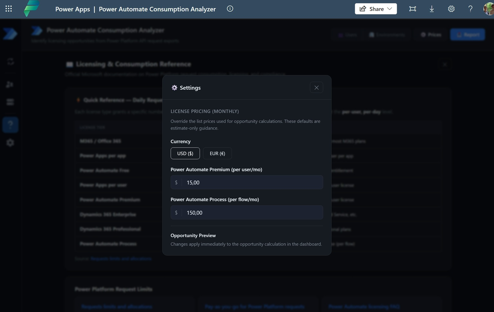

# Power Automate Consumption Analyzer

A **Power Apps Code Component** that analyzes Power Platform request consumption data and provides actionable licensing recommendations. Upload your exports from the Power Platform Admin Center (PPAC), and instantly see which users or flows need Premium or Process licenses — and where you can save costs.

Built for **Power Platform administrators** who need to manage licensing compliance across environments.

> **Privacy**: All data processing happens entirely in your browser. No data is sent to any server or external service.


---

## Key Features

- **Multi-format file upload** — Drag-and-drop CSV or Excel files (up to 100 MB) exported from PPAC
- **Three report types supported**:
  - Licensed User — per-user request consumption
  - Non-Licensed User — system/non-interactive user consumption against the tenant pool
  - Per Flow Licensed Flows — per-flow or process license consumption
- **Compliance analysis** — Automatically classifies users/flows against Microsoft's licensing thresholds
- **Licensing recommendations** — Identifies who needs Premium, who needs Process licenses, and where you can downgrade
- **Interactive dashboard** — KPIs, compliance rate, annual opportunity forecast, and usage pattern breakdown
- **Drill-down views** — Per-user and per-environment detail with daily usage heatmaps and trend charts
- **Environment overview** — Health cards per environment showing non-compliant counts and mini trend charts
- **Configurable pricing** — Adjust Premium and Process license pricing in USD or EUR
- **Excel report export** — Download summary reports, user detail exports, and full seller reports with timestamped filenames

---

## Licensing Thresholds Reference

The analyzer uses the following Power Platform request thresholds:

| License Tier | Daily Request Limit | Note |
|---|---|---|
| M365 / Office 365 | 6,000 | Included with most M365 plans |
| Power Apps per app | 6,000 | Per licensed user per app |
| Power Automate Free | 6,000 | Basic seeded entitlement |
| Power Apps per user | 40,000 | Premium per-user license |
| Power Automate Premium | 40,000 | Premium per-user license |
| Dynamics 365 Enterprise | 40,000 | Sales, CS, Field Service, etc. |
| Dynamics 365 Professional | 20,000 | D365 Professional plans |
| Power Automate Process | 250,000 | Per-flow license (per flow) |

The tool uses **8,000** as the standard threshold (covering M365/basic entitlements), **40,000** for Premium, and **250,000** for Process licenses.

---

## Recommendation Categories

| Recommendation | Meaning |
|---|---|
| **Covered** | Compliant — peak usage within entitlement |
| **Premium** | Peak usage exceeds 8,000 but stays under 40,000 — needs Premium license |
| **Process** | Peak usage exceeds 40,000 — needs Process (per-flow) license(s) |
| **Downgrade to Premium** | Per-flow only: peak usage ≤ 40,000. Could use cheaper Premium instead |

---

## Prerequisites

- A **Power Platform environment** to install the managed solution
- Access to the **Power Platform Admin Center** to export consumption reports
- For development: **Node.js 18+** and **npm**

---

## Installation

### Option A: Managed Solution (recommended)

1. Go to the [Releases](../../releases) page of this repository
2. Download the latest managed solution `.zip` file
3. Import it into your Power Platform environment via **make.powerapps.com** > Solutions > Import
4. The app will be available in your environment's app list

### Option B: Build from Source

```bash
git clone https://github.com/<your-username>/PAuConsumptionApp.git
cd PAuConsumptionApp
npm install
npm run dev
```

This starts a local dev server. For deployment to Power Apps:

```bash
npm run build
```

Then deploy using the Power Apps CLI (`pac`).

---

## How to Export Data from PPAC

1. Go to the [Power Platform Admin Center](https://admin.powerplatform.microsoft.com/)
2. Navigate to **Billing** > **Licenses** > **Capacity add-ons** > **Microsoft Power Platform Requests**
3. Download one of the three available report types:
   - **Licensed User** — per-user consumption for licensed users
   - **Non-Licensed User** — non-interactive/system user consumption against tenant pool
   - **Per Flow Licensed Flows** — per-flow or process license consumption
4. Export as CSV or Excel

A sample file is included in the `data/` folder for reference.

---

## How to Use

1. **Upload** — Select your report type and drag-and-drop (or browse) your PPAC export file
2. **Summary Dashboard** — View KPIs: total users/flows analyzed, compliance rate, Premium/Process needs, and annual opportunity value
3. **Users/Flows Table** — Search, filter, and sort the detail view. Click any row to drill down.
4. **User Drill-Down** — See per-environment breakdown with daily usage heatmaps and trend charts showing capacity thresholds
5. **Environment View** — Browse environment health cards with mini trend charts and non-compliant counts
6. **Settings** — Adjust Premium ($15/mo default) and Process ($150/mo default) license pricing in USD or EUR
7. **Export** — Download reports as Excel: Summary, Full Report (with Top 20 Premium, Top 10 Process, opportunity value), or filtered user detail

### Screenshots

| User Details | User Drill-Down |
|---|---|
|  |  |

| Environment Details | Settings |
|---|---|
|  |  |

---

## Tech Stack

| Component | Details |
|---|---|
| Framework | React 19 + TypeScript |
| Build Tool | Vite |
| Deployment | Power Apps Code Component |
| File Parsing | [xlsx](https://www.npmjs.com/package/xlsx) (CSV/Excel) |
| Export | [file-saver](https://www.npmjs.com/package/file-saver) (Excel download) |
| Styling | CSS with custom properties (dark theme) |

---

## Project Structure

```
src/
├── App.tsx                         # Main app — state management, view routing
├── App.css                         # Application styles
├── main.tsx                        # React entry point
├── components/
│   ├── FileUpload.tsx              # Drag-and-drop file input with progress
│   ├── SummaryDashboard.tsx        # KPIs & opportunity forecast
│   ├── UsersTable.tsx              # Searchable, sortable detail table with export
│   ├── UserDrillDown.tsx           # Per-user: environment breakdown, heatmap, trend chart
│   ├── EnvironmentView.tsx         # Environment health cards
│   ├── EnvironmentDrillDown.tsx    # Per-environment: trend chart, daily detail
│   ├── SettingsPanel.tsx           # License price configuration (USD/EUR)
│   └── HelpPage.tsx                # Licensing docs & thresholds reference
├── types/
│   └── index.ts                    # TypeScript interfaces & constants
└── utils/
    ├── fileParser.ts               # CSV/Excel parsing, auto-detection, date handling
    ├── complianceAnalyzer.ts       # Aggregation, classification, recommendations
    └── reportGenerator.ts          # Excel workbook generation
```

---

## Contributing

Contributions are welcome! Please:

1. Open an [Issue](../../issues) to report bugs or suggest features
2. Fork the repo and create a branch for your changes
3. Submit a Pull Request with a clear description of what you changed and why

---

## License

This project is licensed under the [MIT License](LICENSE).

---

## Disclaimer

This tool is provided as-is for informational purposes. Licensing recommendations are based on observed consumption patterns and the thresholds documented by Microsoft. Always verify recommendations against the latest [Microsoft Power Platform licensing documentation](https://learn.microsoft.com/en-us/power-platform/admin/api-request-limits-allocations) before making purchasing decisions.
